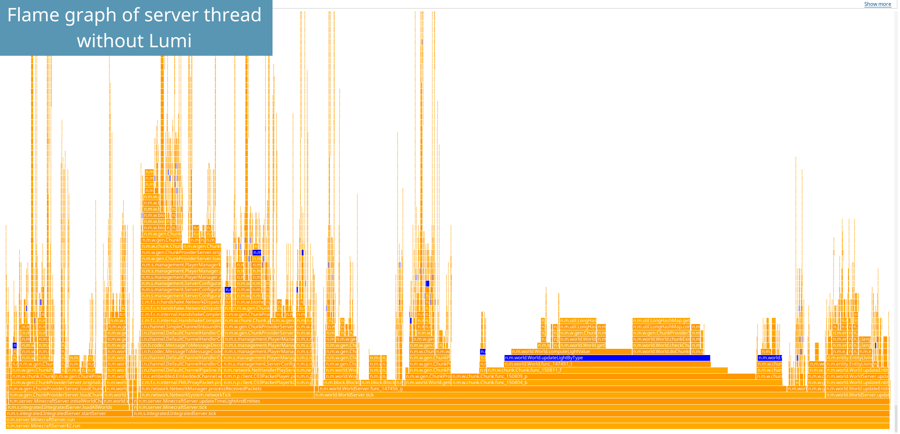
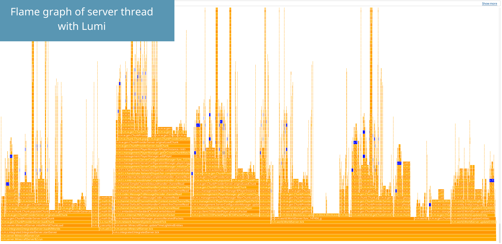

# Lumi 

**[CurseForge](https://www.curseforge.com/minecraft/mc-mods/lumi) | [Modrinth](https://modrinth.com/mod/lumi1710)**

A full replacement of the Minecraft lighting engine with an extendable API, shipping
with [Phosphor](src/main/java/com/falsepattern/lumi/internal/lighting/phosphor/PhosphorLightingEngine.java) as a
reference implementation.

[Join us on Discord](https://discord.gg/h7XAeCSfbT)

## Dependencies

- [ChunkAPI 0.5.0+](https://github.com/FalsePattern/ChunkAPI)
- [FalsePatternLib 1.2.0+](https://github.com/FalsePattern/FalsePatternLib)
- [UniMixins 0.1.11+](https://github.com/LegacyModdingMC/UniMixins)

## Performance

The main performance improvement comes from the fact that the lighting engine is evaluated "lazily", thus it is able to batch more lighting updates
into a single pass.

Here are some simple to understand values, generated via profiling a pre-set test case:

Test Case

- World Type: Default
- World Seed: 123
- Game Mode: Creative
- Render Distance: 16

Profiler is started right before clicking Create New World, and stopped after 10 seconds of flying in a straight line in creative mode.

Without Lumi, the active server time spent in lighting engine is 34% of the total active server time (not counting when the server thread is sleeping).

With Lumi, this fraction goes down to 13%, or an approximately 2.5x performance increase over vanilla.

Flame Graphs

Horizontal axis is time, vertical axis is the call stack. The blue highlighted parts are calls to the lighting engine update method.

## Incompatibilities

- [ArchaicFix](https://github.com/embeddedt/ArchaicFix): Config Change Needed
  - As both mods replace the same parts of code, naturally you will need to set `enablePhosphor` to `false` in the
    ArchaicFix config.
- [CoreTweaks](https://github.com/makamys/CoreTweaks): Config Change Needed
  - The `fix_heightmap_range` feature is already implemented in Lumi's lighting engine. Set it to `false` in the
    CoreTweaks config.

Both of these configs will be automatically modified by Lumi automatically when you launch the game, so you shouldn't even
need to edit the config files manually.

## Authors

- [FalsePattern](https://github.com/FalsePattern)
- [Ven](https://github.com/basdxz)

## Credits

- [embeddedt](https://github.com/embeddedt)
  - The initial port
    of [Phosphor into 1.7.10](https://github.com/embeddedt/ArchaicFix/blob/main/src/main/java/org/embeddedt/archaicfix/lighting/world/lighting/LightingEngine.java)
- [CaffeineMC](https://github.com/CaffeineMC)
  - Creating the original [Phosphor](https://github.com/CaffeineMC/phosphor-fabric)
